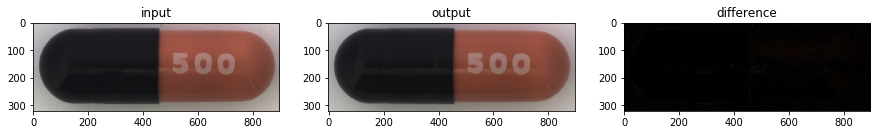
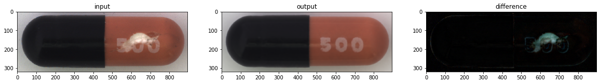
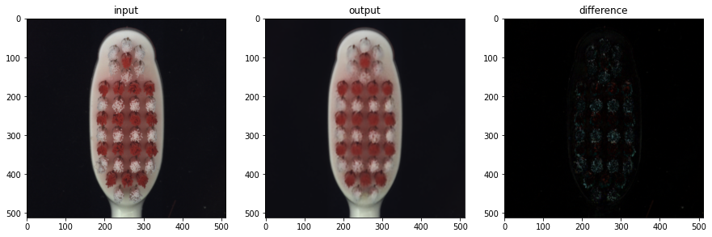
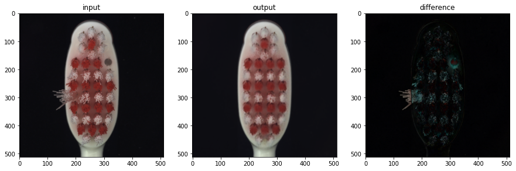
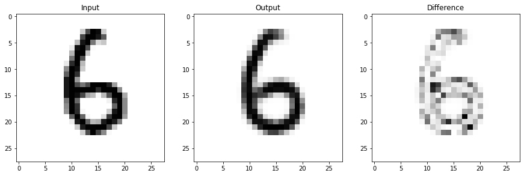
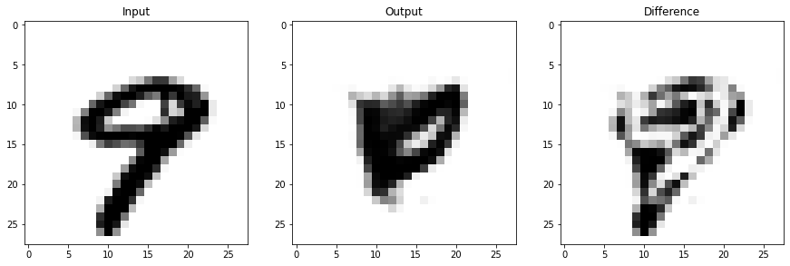
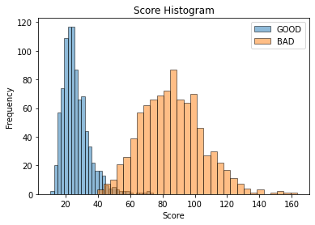

# Variational AutoEncoder(VAE)を用いた異常検出

- 教師なし学習。  
- 生データと再構成した画像との差異の大きさで正常/異常を判定。  
- [プレゼンテーション資料](https://github.com/tkyiw/VariationalAutoEncoder/blob/master/%E3%83%97%E3%83%AC%E3%82%BC%E3%83%B3%E3%83%86%E3%83%BC%E3%82%B7%E3%83%A7%E3%83%B3%E8%B3%87%E6%96%99.pdf)

### 動作環境
- Python: 3.6.9
- TensorFlow: 2.3.0

# 実行例
### サンプル１
- 正常

- 異常

### サンプル２
- 正常

- 異常

# 検証例
- 正常：６の手書き画像（学習データ:5918枚/検証データ:958枚）
- 異常：９の手書き画像（検証データ:958枚）

### サンプル３
- 正常

- 異常

### 結果

Score: 差異の大きさ
